Nama: Shinta Yulistiana
NIM: 362358302076
Kelas: 2A TRPL

Praktikum 1: Dasar State dengan Model-View

Langkah 1: Buat Project Baru

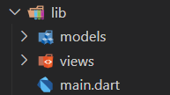

Langkah 2: Membuat model task.dart
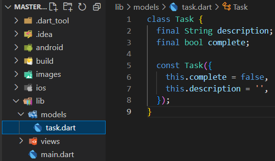

Langkah 3: Buat file plan.dart
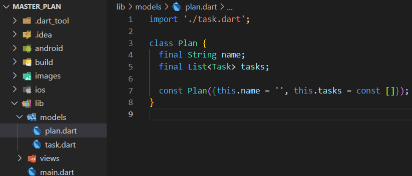

Langkah 4: Buat file data_layer.dart
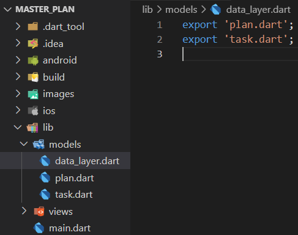

Langkah 5: Pindah ke file main.dart
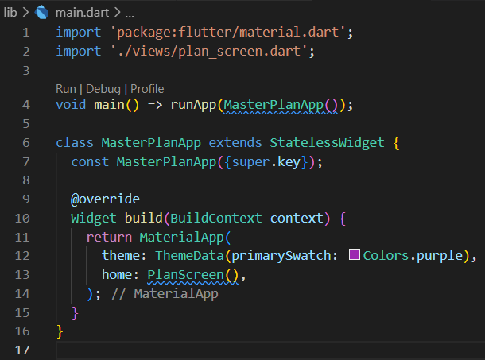

Langkah 6: buat plan_screen.dart
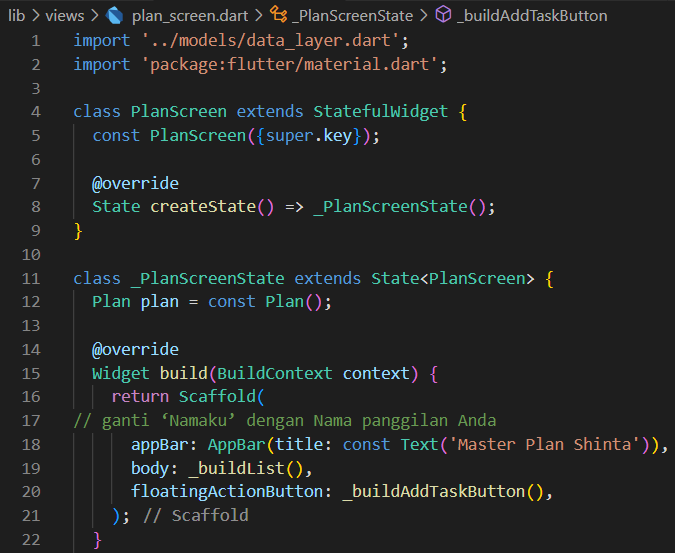

Langkah 7: buat method \_buildAddTaskButton()
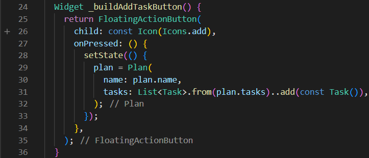

Langkah 8: buat widget \_buildList()
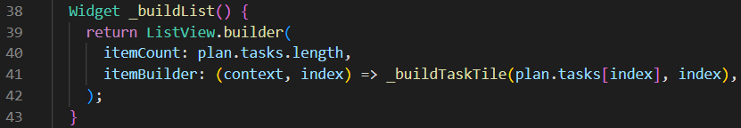

Langkah 9: buat widget \_buildTaskTile
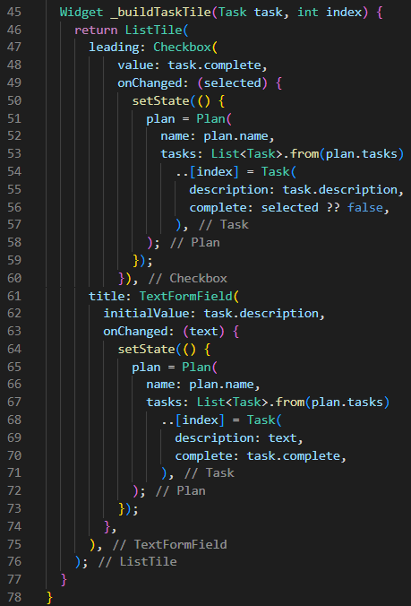
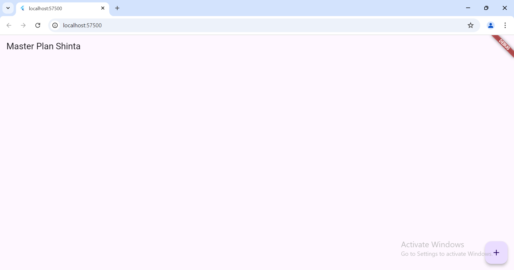

Langkah 10: Tambah Scroll Controller
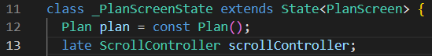

Langkah 11: Tambah Scroll Listener
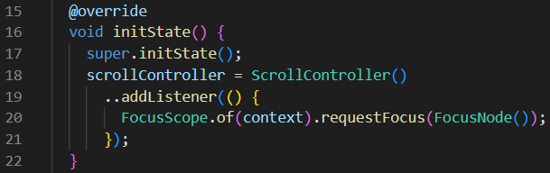

Langkah 12: Tambah controller dan keyboard behavior
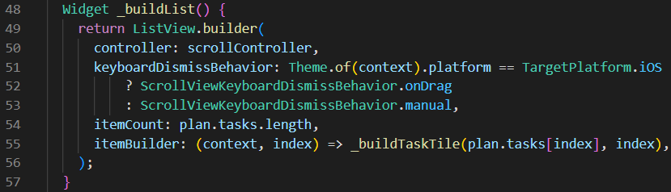

Langkah 13: Terakhir, tambah method dispose()
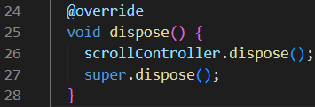

Langkah 14: Hasil
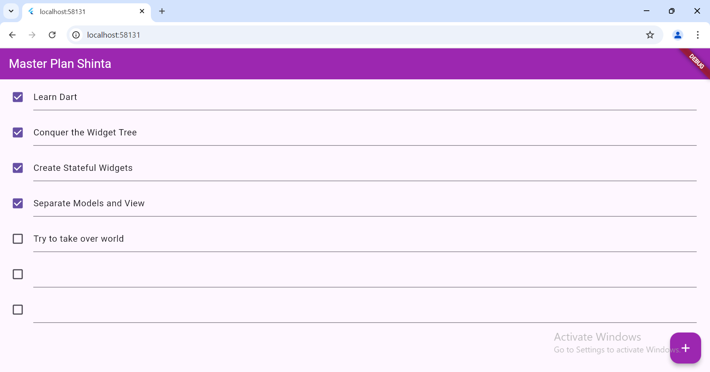

Tugas Praktikum 1: Dasar State dengan Model-View

1. Selesaikan langkah-langkah praktikum tersebut, lalu dokumentasikan berupa GIF hasil akhir praktikum beserta penjelasannya di file README.md! Jika Anda menemukan ada yang error atau tidak berjalan dengan baik, silakan diperbaiki.
   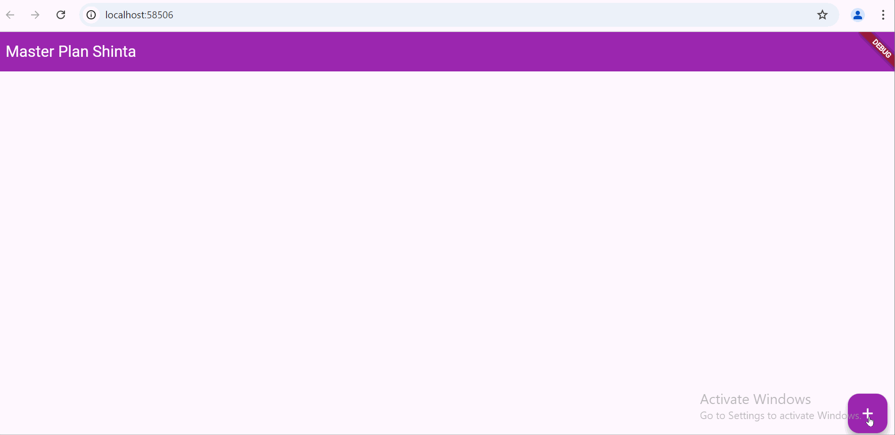, pada gambar tersebut telah dibuat list atau plan yang bisa ditambah sesuai kebutuhan.

2. Jelaskan maksud dari langkah 4 pada praktikum tersebut! Mengapa dilakukan demikian?
   Maksud dari langkah 4 pada praktikum 1 adalah bertujuan untuk menyederhanakan proses impor. Dengan mengekspor plan.dart dan task.dart melalui data_layer.dart, maka cukup mengimpor data_layer.dart saja untuk mendapatkan akses pada keduanya dan membuat kode lebih efisien dan rapi.

3. Mengapa perlu variabel plan di langkah 6 pada praktikum tersebut? Mengapa dibuat konstanta ?
   Perlu variabel plan di langkah 6 pada praktikum 1 karena variabel plan berfungsi sebagai wadah untuk menyimpan data rencana atau plan yang akan ditampilkan di layar.
   Dibuat konstanta karena dengan membuat plan sebagai konstanta dan memberikan nilai awal const Plan(), maka memastikan bahwa variabel tersebut memiliki nilai default
   pada saat aplikasi pertama kali dijalankan. Nilai tidak dapat diubah secara langsung setelah inisialisasi. Membuat plan sebagai konstanta membantu menjaga integritas data.

4. Lakukan capture hasil dari Langkah 9 berupa GIF, kemudian jelaskan apa yang telah Anda buat!
   , pada gambar tersebut telah dibuat list atau plan yang bisa ditambah sesuai kebutuhan.

5. Apa kegunaan method pada Langkah 11 dan 13 dalam lifecyle state ?
   - initState() digunakan untuk inisialisasi awal.
   - dispose() digunakan untuk membersihkan sumber daya.
   - ScrollController digunakan untuk mengontrol scrolling.
   - Listener pada ScrollController digunakan digunakan untuk mendeteksi perubahan posisi scroll dan menghilangkan fokus.
     Dengan menghilangkan fokus saat scrolling, keyboard akan tertutup secara otomatis, sehingga pengguna dapat lebih fokus pada konten yang sedang dilihat.

Praktikum 2: Mengelola Data Layer dengan InheritedWidget dan InheritedNotifier
Langkah 1: Buat file plan_provider.dart
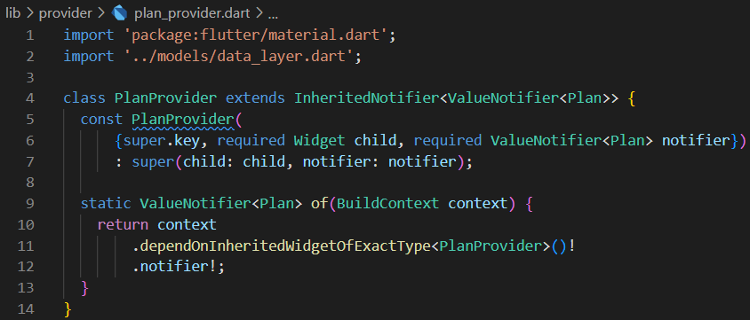

Langkah 2: Edit main.dart
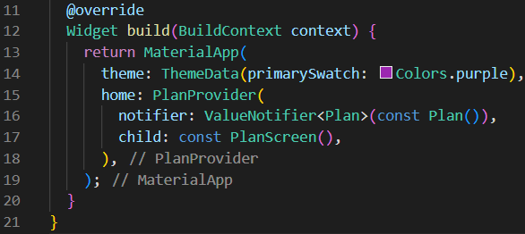

Langkah 3: Tambah method pada model plan.dart
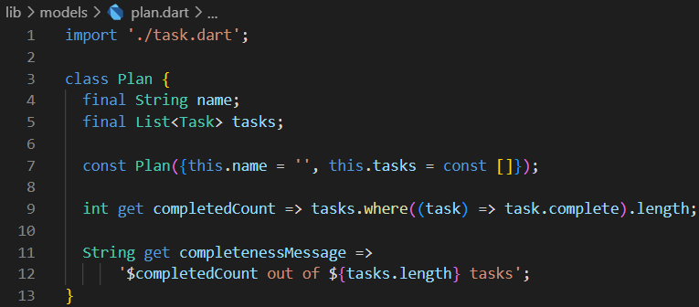

Langkah 4: Pindah ke PlanScreen
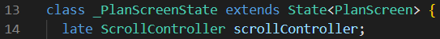

Langkah 5: Edit method \_buildAddTaskButton
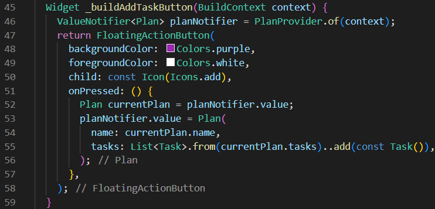

Langkah 6: Edit method \_buildTaskTile
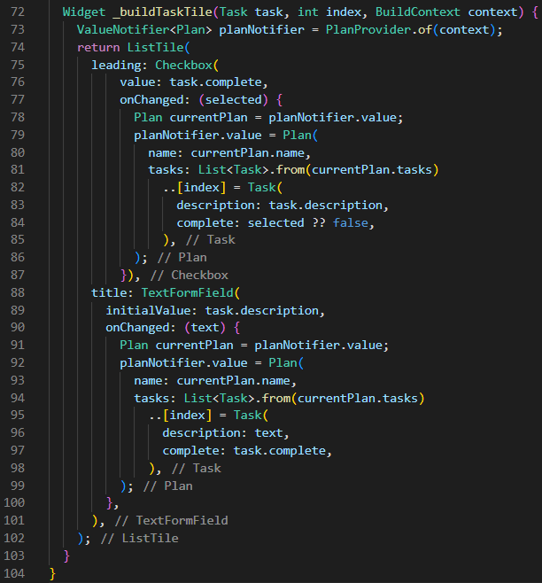

Langkah 7: Edit \_buildList
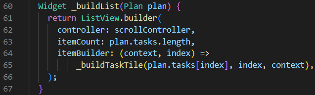

Langkah 9: Tambah widget SafeArea
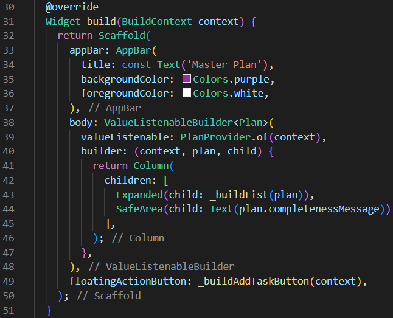

Tugas Praktikum 2: InheritedWidget

2. Jelaskan mana yang dimaksud InheritedWidget pada langkah 1 tersebut! Mengapa yang digunakan InheritedNotifier?

- InheritedWidget adalah sebuah widget yang dapat memberikan data ke turunannya tanpa perlu melewati proses props secara eksplisit.
- InheritedNotifier digunakan untuk memantau perubahan data dan memudahkan akses data.
  Dengan menggunakan InheritedNotifier, PlanProvider dengan efisien membagikan Plan ke seluruh widget tree, memastikan bahwa perubahan pada data tersebut akan segera ada dalam tampilan.

3. Jelaskan maksud dari method di langkah 3 pada praktikum tersebut! Mengapa dilakukan demikian?

   - Maksud dari method di langkah 3 praktikum tersebut adalah metode getCompleteMessage berfungsi untuk membentuk sebuah pesan yang menginformasikan tentang progres penyelesaian tugas.
     Pesan tersebut akan menunjukkan berapa banyak tugas yang telah selesai dibandingkan dengan total jumlah tugas.
   - Dilakukan demikian karena memberikan informasi yang jelas kepada pengguna dengan menampilkan pesan yang spesifik tentang jumlah tugas yang selesai, meningkatkan user expirience yaitu
     pesan tersebut membuat aplikasi menjadi lebih interaktif dan informatif serta memudahkan dalam pengembangan fitur lain seperti informasi mengenai jumlah tugas yang selesai dan total
     tugas dapat digunakan untuk membuat fitur-fitur lain seperti persentase penyelesaian, notifikasi, atau laporan.

Praktikum 3: Membuat State di Multiple Screens
Langkah 1: Edit PlanProvider
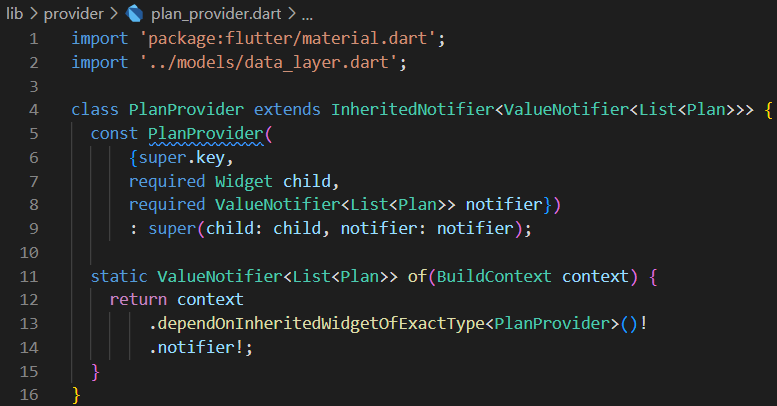

Langkah 2: Edit main.dart
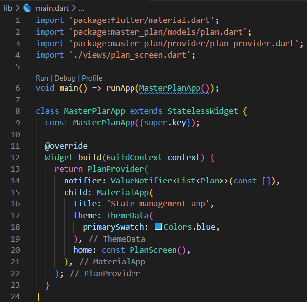
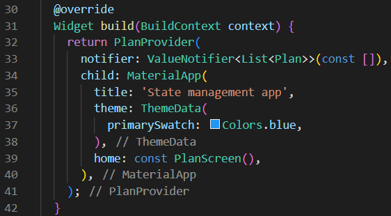

Langkah 3: Edit plan_screen.dart
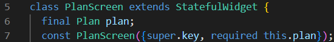

Langkah 5: Tambah getter Plan
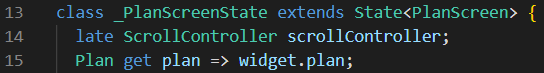

Langkah 6: Method initState()
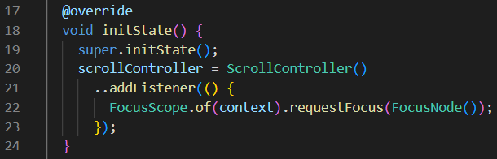

Langkah 7: Widget build
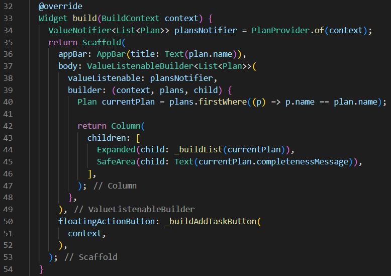
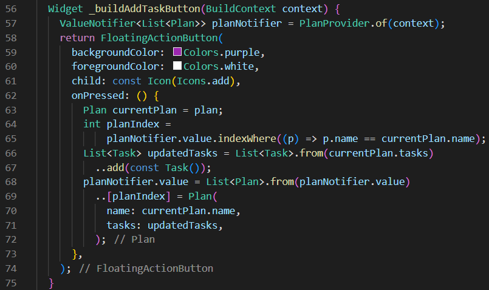

Langkah 8: Edit \_buildTaskTile
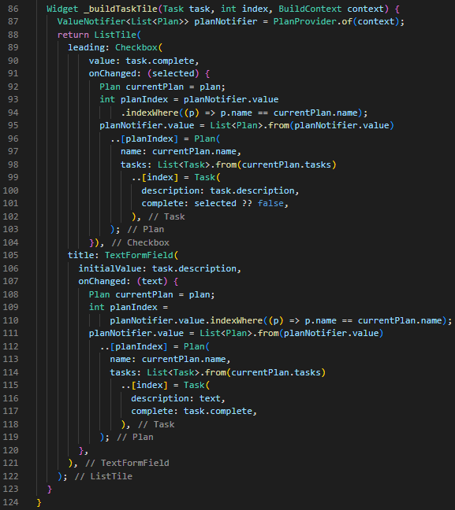

Langkah 9: Buat screen baru
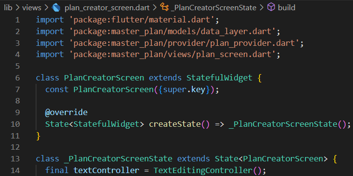
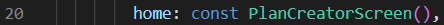

Langkah 10: Pindah ke class \_PlanCreatorScreenState
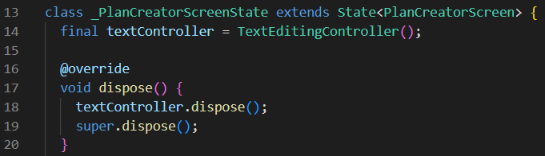

Langkah 11: Pindah ke method build
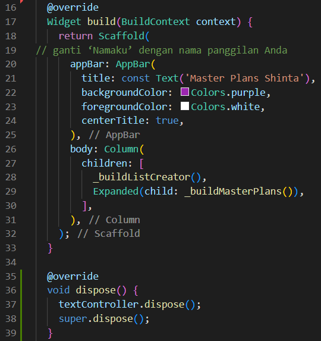

Langkah 12: Buat widget \_buildListCreator
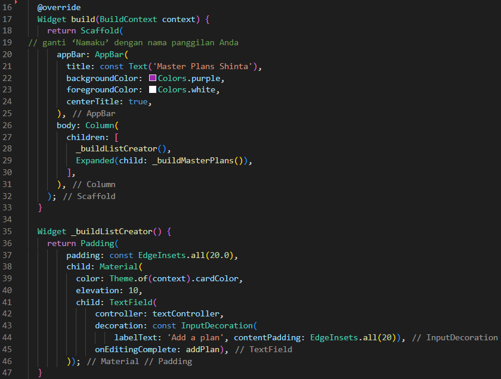

Langkah 13: Buat void addPlan()
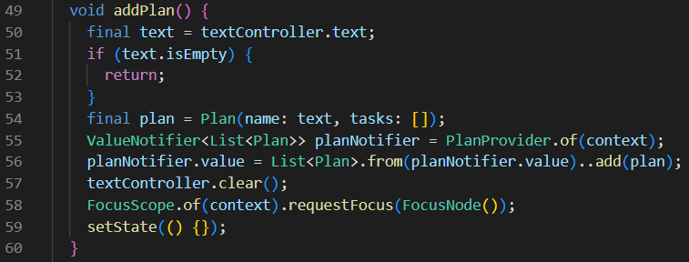

Langkah 14: Buat widget \_buildMasterPlans()
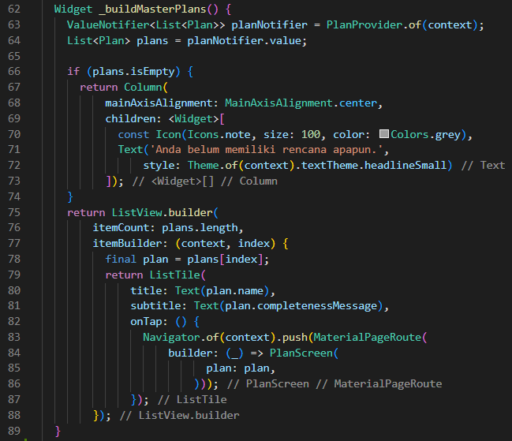
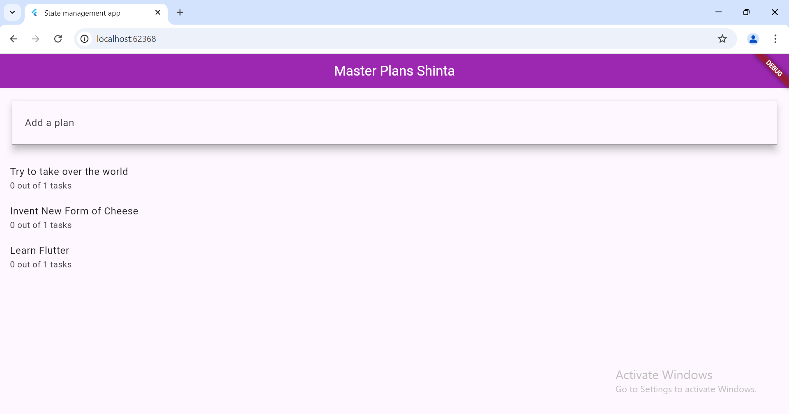

Tugas Praktikum 3: State di Multiple Screens

1. Selesaikan langkah-langkah praktikum tersebut, lalu dokumentasikan berupa GIF hasil akhir praktikum beserta penjelasannya di file README.md! Jika Anda menemukan ada yang error atau tidak berjalan dengan baik, silakan diperbaiki sesuai dengan tujuan aplikasi tersebut dibuat.
   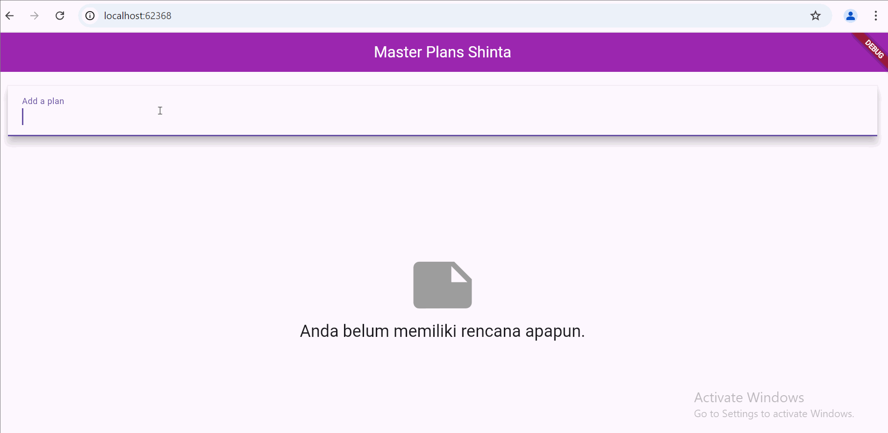, pada gambar tersebut telah dibuat list atau plan yang bisa ditambah sesuai kebutuhan.

2. Berdasarkan Praktikum 3 yang telah Anda lakukan, jelaskan maksud dari gambar diagram berikut ini!
   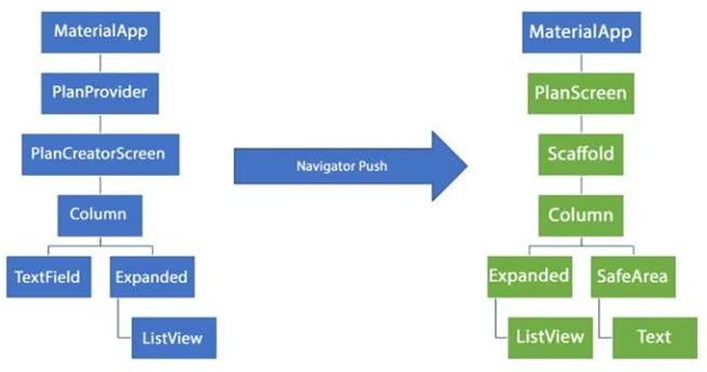

   - Aplikasi memiliki struktur widget yang terdiri dari MaterialApp, PlanProvider, PlanCreatorScreen, Column, TextField, Expanded, dan ListView.
   - PlanCreatorScreen merupakan tampilan utama yang sedang aktif.
   - Terjadi sebuah tindakan navigasi yang diwakili oleh panah biru dengan label "Navigator Push".
   - Tindakan tersebut biasanya dipicu oleh suatu event, misalnya ketika pengguna menekan tombol "Tambah plan" atau yang lain.

3. Lakukan capture hasil dari Langkah 14 berupa GIF, kemudian jelaskan apa yang telah Anda buat!
   , pada gambar tersebut telah dibuat list atau plan yang bisa ditambah sesuai kebutuhan.
